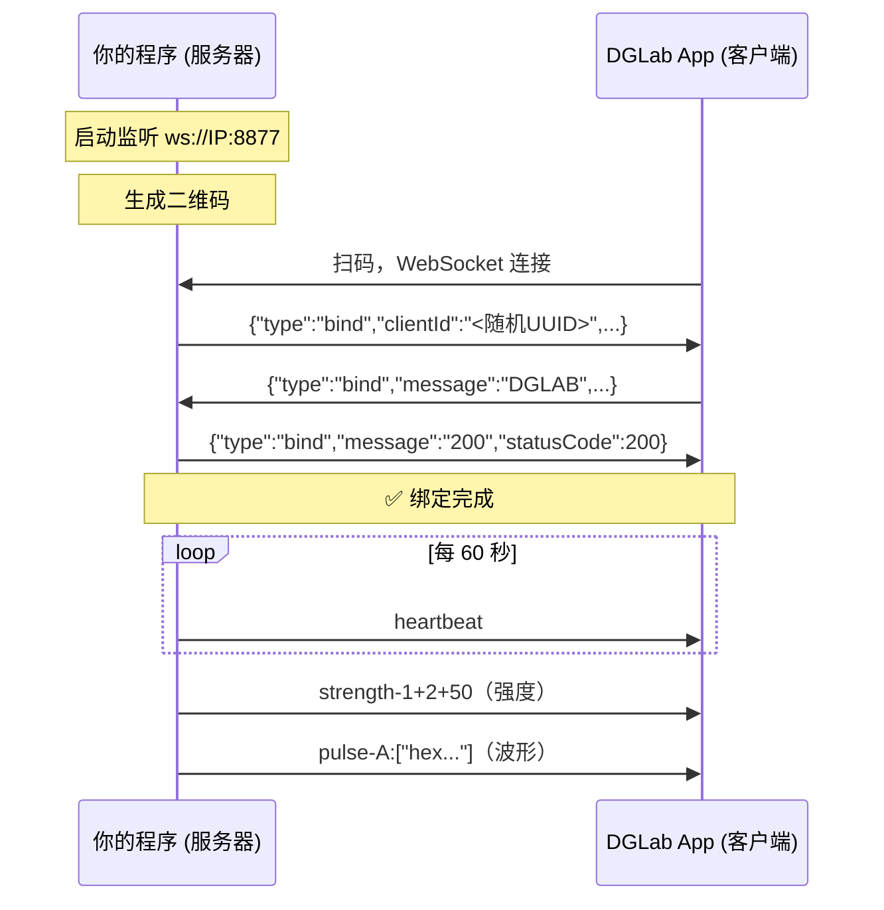

<div align="center">

# 🐺 Native郊狼

### DGLab C++ 通用对接库

**拖进项目就能用 · 一个 .h + 一个 .cpp · WebSocket 协议直连 App**

**Author:** 全世界最最最最可爱的小夜酱喵


基于 DG_LAB WebSocket 协议，通过监控游戏事件触发设备物理反馈。

</div>

---

## 📖 目录

- [🚀 快速开始](#-快速开始)
- [API 速查](#-api-速查)
- [🎮 游戏对接示例](#-游戏对接示例)
- [📡 通信协议](#-通信协议)
- [📦 依赖库](#-依赖库)
- [🔨 编译指南](#-编译指南)
- [📁 完整文件清单](#-完整文件清单)
- [🙏 协议参考](#-协议参考)

---

## 🚀 快速开始

### 1. 复制文件

只需 2 个文件 + 1 个目录：

```
your_project/
├── dglab_core.h       ← 拖进去
├── dglab_core.cpp     ← 拖进去
└── include/           ← 拖进去（第三方头文件库）
```

### 2. 最小示例

```cpp
#include "dglab_core.h"

DGLab::Core dglab;

void init() {
    dglab.start(8877);  // 启动服务器
}

void onPlayerHit(int lostHp) {
    dglab.triggerHit(lostHp);  // 受伤 → 轻微电击
}

void onPlayerDeath() {
    dglab.triggerDeath(80);    // 死亡 → 高强度反馈
}

void renderUI() {
    if (!dglab.isBound()) {
        drawQRCode(dglab.getQrUrl());  // 显示二维码
    }
}
```

### 3. 编译配置

```makefile
LOCAL_C_INCLUDES += $(LOCAL_PATH)/你的路径/include
LOCAL_CPPFLAGS += -DASIO_STANDALONE -D_WEBSOCKETPP_CPP11_STL_ -DASIO_HAS_STD_CHRONO
LOCAL_CPPFLAGS += -fexceptions -frtti -Wno-deprecated-declarations
LOCAL_SRC_FILES += 你的路径/dglab_core.cpp
```

---

## API 速查

### 连接管理

```cpp
DGLab::Core dglab;

dglab.start(8877);              // 启动 WebSocket 服务器
dglab.stop();                   // 停止

dglab.getState();               // STOPPED / LISTENING / CONNECTED / BOUND / ERROR
dglab.isBound();                // 绑定完成 = 可以发指令
dglab.isConnected();            // App 已连上

dglab.getLocalIp();             // 自动获取的局域网 IP
dglab.getPort();                // 端口号
dglab.getQrUrl();               // App 扫码用的完整 URL
```

### 控制指令

```cpp
// 设置强度（通道 A=1, B=2，强度 0~100）
dglab.sendStrength(1, 50);      // A 通道 50
dglab.sendStrengthAB(30, 60);   // A=30, B=60

// 发送波形（hex 数组，从 waveforms/*.json 的 data 字段读取）
std::vector<std::string> hexData = {"6e6e6e6e64646464", ...};
dglab.sendWaveform(1, hexData);
dglab.sendWaveformWithStrength(1, hexData, 50);

// 清空 / 停止
dglab.clearChannel(1);          // 清空 A 通道波形队列
dglab.silenceAll();             // 清空所有 + 强度归零

// 自定义 JSON
dglab.sendRaw("{\"type\":\"msg\",\"message\":\"custom\"}");
```

### 游戏事件快捷方法

```cpp
// 受伤反馈：按失血量自动算强度（maxStrength 上限，默认 30 高强度竞技推荐5-15）
dglab.triggerHit(lostHp, 30);

// 死亡反馈：清空 + 高强度（默认 80 推荐45）
dglab.triggerDeath(80);
```

### 回调

```cpp
dglab.setOnStateChange([](DGLab::State state) {
    // 状态变化通知
});

dglab.setOnMessage([](const std::string& msg) {
    // 收到 App 消息
});
```

---

## 🎮 游戏对接示例

### 方式一：内存读取（需要 root）

```cpp
#include "dglab_core.h"

DGLab::Core dglab;
int previousHp = 100;

void init() {
    dglab.start(8877);
}

// 在你的游戏监控循环中调用
void checkPlayerHp() {
    int currentHp = readHpFromMemory();  // 你自己的内存读取实现

    if (currentHp < previousHp) {
        int lost = previousHp - currentHp;

        if (currentHp <= 0) {
            dglab.triggerDeath(80);     // 死亡 → 高强度
        } else {
            dglab.triggerHit(lost);     // 受伤 → 按失血量反馈
        }
    }
    previousHp = currentHp;
}
```

### 方式二：像素找色（免 root）

```cpp
#include "dglab_core.h"

DGLab::Core dglab;
int previousHpPercent = 100;

void init() {
    dglab.start(8877);
}

// 计算血条颜色占比
int getHpPercent() {
    // 扫描血条区域，统计红色像素占比
    int total = 0, matched = 0;
    for (int x = 100; x < 500; x += 2) {  // 血条区域 (100,50) ~ (500,70)
        for (int y = 50; y < 70; y += 2) {
            total++;
            uint8_t r, g, b = getPixelColor(x, y);  // 你自己的截图实现
            if (r > 180 && g < 80 && b < 80) matched++;  // 红色判定
        }
    }
    return (matched * 100) / total;
}

void checkPlayerHp() {
    int hpPercent = getHpPercent();

    if (hpPercent < previousHpPercent) {
        int lost = previousHpPercent - hpPercent;

        if (hpPercent <= 0) {
            dglab.triggerDeath(80);
        } else {
            dglab.triggerHit(lost);
        }
    }
    previousHpPercent = hpPercent;
}
```

### 方式三：规则引擎（高级用法）

```cpp
#include "dglab_core.h"

DGLab::Core dglab;

// 自定义规则：血量低于 30% 时持续警告
void checkRules(int currentHp, int maxHp) {
    float pct = (float)currentHp / maxHp;

    // 血量低于 30% → 低强度持续刺激
    if (pct < 0.3f && pct > 0.0f) {
        int strength = (int)((0.3f - pct) * 100);  // 越低越强
        dglab.sendStrengthAB(strength, strength);
    }

    // 血量归零 → 死亡反馈
    if (currentHp <= 0) {
        dglab.triggerDeath(80);
    }
}
```

---

## 📡 通信协议

### 扫码连接 URL

```
https://www.dungeon-lab.com/app-download.php#DGLAB-SOCKET#ws://IP:PORT/FIXED_CLIENT_ID
```

| 字段 | 示例值 | 说明 |
|------|--------|------|
| `IP` | `192.168.1.100` | 自动获取的局域网 IP |
| `PORT` | `8877` | WebSocket 监听端口 |
| `FIXED_CLIENT_ID` | `1234-123456789-12345-12345-01` | 固定客户端标识 |

### 握手流程



### 消息格式

| 类型 | 格式 | 方向 | 说明 |
|------|------|------|------|
| **绑定** | `{"type":"bind",...}` | 双向 | 握手建立连接 |
| **心跳** | `{"type":"heartbeat",...}` | 双向 | 60 秒保活 |
| **强度** | `"strength-<通道>+2+<值>"` | 你→App | 通道: 1=A, 2=B |
| **波形** | `"pulse-<A|B>:[hex数组]"` | 你→App | 每帧 16 位 hex |
| **清空** | `"clear-<通道>"` | 你→App | 清空波形队列 |

---

## 📦 依赖库

| 库 | 版本 | 用途 |
|----|------|------|
| [WebSocket++](https://github.com/zaphoyd/websocketpp) | 0.8.2 | WebSocket 服务器 |
| [Standalone Asio](https://github.com/chriskohlhoff/asio) | 1.12.2 | 网络 IO（无需 Boost） |
| [nlohmann/json](https://github.com/nlohmann/json) | 3.11.3 | JSON 解析 |

> 全部内置在 `include/` 目录，拖进项目即可。

---

## 🔨 编译指南

### Android.mk

```makefile
# 头文件
LOCAL_C_INCLUDES += $(LOCAL_PATH)/你的路径/include

# 编译宏
LOCAL_CPPFLAGS += -DASIO_STANDALONE -D_WEBSOCKETPP_CPP11_STL_ -DASIO_HAS_STD_CHRONO
LOCAL_CPPFLAGS += -fexceptions -frtti -Wno-deprecated-declarations

# 源文件（只需一个）
LOCAL_SRC_FILES += 你的路径/dglab_core.cpp
```

### CMakeLists.txt

```cmake
target_include_directories(your_target PRIVATE your_path/include)
target_compile_definitions(your_target PRIVATE
    ASIO_STANDALONE _WEBSOCKETPP_CPP11_STL_ ASIO_HAS_STD_CHRONO)
target_compile_options(your_target PRIVATE -fexceptions -frtti)
target_sources(your_target PRIVATE your_path/dglab_core.cpp)
```

---

## 📁 完整文件清单

```
Native郊狼/
│
├── dglab_core.h/.cpp         ← ⭐ 核心库（拖这 2 个文件 + include/ 就能用）
│
├── include/                   ← 第三方头文件库（内置，无需额外下载）
│   ├── websocketpp/           ←   WebSocket++ 0.8.2
│   ├── asio/ + asio.hpp       ←   Standalone Asio 1.12.2
│   ├── nlohmann/json.hpp      ←   JSON 单头文件 v3.11.3
│   └── boost/asio.hpp         ←   兼容包装器
│
├── waveforms/                 ← 18 种预置波形 JSON（可选，按需加载）
│   ├── heartbeat.json
│   ├── breath.json
│   └── ... (16 more)
│
├── dglab_protocol.h/.cpp      ← 协议底层（dglab_core 已内置，此为独立模块）
├── websocket_server.h/.cpp    ← 服务器底层（同上）
├── qrcode_native.h/.cpp       ← ImGui 二维码绘制（可选）
├── qrcodegen.hpp/.cpp         ← QR 编码引擎（qrcode_native 依赖）
├── imgui_dglab_ui.h/.cpp      ← ImGui 面板组件（可选）
├── game_hook.h/.cpp           ← 游戏事件框架（可选）
├── game_example.cpp           ← 游戏对接完整示例
└── README.md
```

---

## 🙏 协议参考

| 项目 | 链接 | 说明 |
|------|------|------|
| CaiJi-ikun/DG_LAB | [GitHub](https://github.com/CaiJi-ikun/DG_LAB) | 原项目 |
| DG-LAB-OPENSOURCE | [GitHub](https://github.com/DG-LAB-OPENSOURCE/DG-LAB-OPENSOURCE) | 官方开源 |
| DGLab-Craft | [GitHub](https://github.com/bilbillm/DGLab-Craft) | MC Mod（协议参考） |

---

<div align="center">

**🐺 Native郊狼** · C++17 + WebSocket++ + Standalone Asio

</div>
