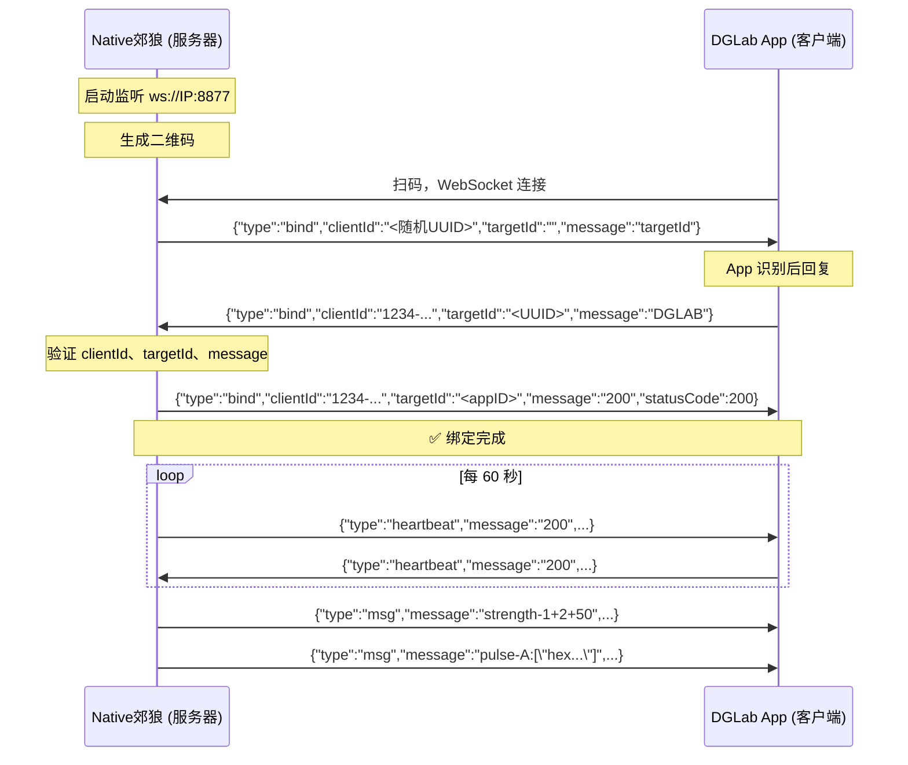

<div align="center">

# 🐺 Native郊狼

### DGLab Native ImGui 控制器

** C++ Native 实现 · 零 Java 依赖 · WebSocket 协议 **

**Author:** 全世界最最最最可爱的小夜酱喵


[Native郊狼对接框架]

基于 [DG_Lab] 的WebSocket 通信协议，移植为 Android Native ImGui 控制面板喵。

可通过监控游戏事件触发DG_LAB终端输出。

建议在专业指导下配置高强度刺激参数。

</div>

---

## 📖 目录

- [架构概览](#-架构概览)
- [文件结构](#-文件结构)
- [通信协议](#-通信协议)
- [依赖库](#-依赖库)
- [编译指南](#-编译指南)
- [使用方法](#-使用方法)
- [协议参考](#-协议参考)

---

## 🏗 架构概览

```
┌─────────────────────────────────────────────────────┐
│                    draw.cpp                          │
│                  (ImGui 主菜单)                       │
│  ┌───────────────────────────────────────────────┐  │
│  │          DGLab 控制面板 (扫码连接)              │  │
│  │  ┌─────────┐  ┌──────────┐  ┌──────────────┐ │  │
│  │  │启动服务器│  │ 强度控制  │  │  波形控制     │ │  │
│  │  │  二维码  │  │ A/B通道  │  │ 18种波形     │ │  │
│  │  └────┬────┘  └────┬─────┘  └──────┬───────┘ │  │
│  └───────┼────────────┼───────────────┼─────────┘  │
└──────────┼────────────┼───────────────┼────────────┘
           │            │               │
           ▼            ▼               ▼
    ┌─────────────┐ ┌──────────┐ ┌──────────────┐
    │ WebSocket   │ │ Protocol │ │  Waveform    │
    │  Server     │ │  Layer   │ │  Manager     │
    │ (Asio+WS++) │ │ (JSON)   │ │ (波形加载)    │
    └──────┬──────┘ └──────────┘ └──────────────┘
           │
           ▼  ws://局域网IP:8877
    ┌──────────────────┐
    │   DGLab App      │
    │  (扫码连接过来)    │
    └──────────────────┘
```

### 核心流程（与 MC Mod 完全一致）

| 步骤 | 动作 | 说明 |
|:---:|------|------|
| 1 | 启动 WebSocket 服务器 | 监听本地端口 `8877` |
| 2 | 生成二维码 | 包含 `ws://IP:PORT/固定客户端ID` |
| 3 | App 扫码连接 | DGLab3.X App 作为客户端连接过来 |
| 4 | 发送 bind 握手 | 服务器主动发 `{"type":"bind","clientId":"<UUID>",...}` |
| 5 | App 回复验证 | `{"type":"bind","message":"DGLAB",...}` |
| 6 | 确认绑定 | `{"message":"200","statusCode":200}` |
| 7 | 控制设备 | 发送强度/波形指令 |

---

## 📁 文件结构

```
Native郊狼/
│
├── 📄 README.md                   ← 本文档
│
├── 🔌 通信层
│   ├── websocket_server.h/.cpp    ← WebSocket 服务器（监听端口等 App 连接）
│   ├── websocket_client.h/.cpp    ← WebSocket 客户端（备用，未启用）
│   └── dglab_protocol.h/.cpp      ← 协议解析 / 消息生成 / UUID / 绑定验证
│
├── 🎮 控制层
│   ├── dglab_controller.h/.cpp    ← 控制器主类（统一 API / 状态机 / 效果调度）
│   └── waveform_manager.h/.cpp    ← 波形管理（加载 JSON / 分块 / 波形数据缓存）
│
├── 🖥 界面层
│   ├── imgui_dglab_ui.h/.cpp      ← ImGui 面板组件（独立模块，可选）
│   ├── qrcode_native.h/.cpp       ← 二维码生成（纯 ImGui 绘制，无纹理依赖）
│   └── qrcodegen.hpp/.cpp         ← QR 编码引擎（nayuki/QR-Code-generator）
│
├── 📂 include/                    ← 第三方头文件库
│   ├── websocketpp/               ← WebSocket++ 0.8.2
│   ├── asio/ + asio.hpp           ← Standalone Asio 1.12.2（不依赖 Boost）
│   ├── nlohmann/json.hpp          ← JSON 单头文件 v3.11.3
│   └── boost/asio.hpp             ← 兼容包装器（1 行重定向）
│
└── 🎵 waveforms/                  ← 18 种波形数据文件
    ├── heartbeat.json             ← 心跳节奏
    ├── breath.json                ← 呼吸
    ├── burn.json                  ← 灼烧
    ├── compress.json              ← 压缩
    ├── tide.json                  ← 潮汐
    └── ... (13 more)
```

---

## 📡 通信协议

### 扫码连接 URL

```
https://www.dungeon-lab.com/app-download.php#DGLAB-SOCKET#ws://IP:PORT/FIXED_CLIENT_ID
```

| 字段 | 示例值 | 说明 |
|------|--------|------|
| `IP` | `192.168.1.100` | 本机局域网 IP（自动获取） |
| `PORT` | `8877` | WebSocket 监听端口 |
| `FIXED_CLIENT_ID` | `1234-123456789-12345-12345-01` | 固定客户端标识 |

### 握手流程



### 消息格式速查

| 类型 | 格式 | 方向 | 说明 |
|------|------|------|------|
| **绑定** | `{"type":"bind","clientId":"...","targetId":"...","message":"..."}` | 双向 | 握手建立连接 |
| **心跳** | `{"type":"heartbeat","message":"200","clientId":"...","targetId":"..."}` | 双向 | 60 秒保活 |
| **强度** | `"strength-<通道>+2+<值>"` | 服务器→App | 通道: 1=A, 2=B |
| **波形** | `"pulse-<A\|B>:[十六进制数组]"` | 服务器→App | 每帧 16 位 hex |
| **清空** | `"clear-<通道>"` | 服务器→App | 清空波形队列 |

---

## 📦 依赖库

| 库 | 版本 | 大小 | 用途 |
|----|------|------|------|
| [WebSocket++](https://github.com/zaphoyd/websocketpp) | 0.8.2 | WebSocket 服务器/客户端 |
| [Standalone Asio](https://github.com/chriskohlhoff/asio) | 1.12.2 | 网络 IO（无需 Boost） |
| [nlohmann/json](https://github.com/nlohmann/json) | 3.11.3 | JSON 解析 |
| [QR-Code-generator](https://github.com/nayuki/QR-Code-generator) | master | 二维码编码 |

> 所有依赖已内置在 `include/` 目录中，无需额外下载。

---

## 🔨 编译指南

### 前置条件

- Android NDK（已配置在 AIDE 或命令行）
- C++17 编译器

### Android.mk 配置

关键编译选项：

```makefile
# 头文件路径
LOCAL_C_INCLUDES += $(LOCAL_PATH)/src/Android_draw/Native郊狼/include
LOCAL_C_INCLUDES += $(LOCAL_PATH)/src/Android_draw/Native郊狼

# 编译宏（Standalone Asio 模式，不依赖 Boost）
LOCAL_CPPFLAGS += -DASIO_STANDALONE -D_WEBSOCKETPP_CPP11_STL_ -DASIO_HAS_STD_CHRONO

# 启用异常和 RTTI（websocket++ / asio 必需）
LOCAL_CPPFLAGS += -fexceptions
LOCAL_CPPFLAGS += -frtti

# 压制 allocator<void> 废弃警告
LOCAL_CPPFLAGS += -Wno-deprecated-declarations

# 源文件
LOCAL_SRC_FILES += src/Android_draw/Native郊狼/dglab_protocol.cpp
LOCAL_SRC_FILES += src/Android_draw/Native郊狼/websocket_server.cpp
LOCAL_SRC_FILES += src/Android_draw/Native郊狼/waveform_manager.cpp
LOCAL_SRC_FILES += src/Android_draw/Native郊狼/dglab_controller.cpp
LOCAL_SRC_FILES += src/Android_draw/Native郊狼/imgui_dglab_ui.cpp
LOCAL_SRC_FILES += src/Android_draw/Native郊狼/qrcodegen.cpp
LOCAL_SRC_FILES += src/Android_draw/Native郊狼/qrcode_native.cpp
```

### 编译命令

```bash
cd /storage/emulated/0/液态玻璃/jni
ndk-build
```

---

## 🎮 使用方法

使用前请确认 ** [DG_LAB App] ** 为3.x版本。

1. 启动程序，勾选你项目主菜单中的 **「DGLab控制器」**
2. 在 DGLab imgui 面板中点击 **「启动服务器」**
3. 用 DGLab App 扫描屏幕上显示的 **二维码**
4. 等待 App 连接并自动完成绑定
5. 通过滑块控制 **A/B 通道强度**，选择并发送 **波形**


---

## 🙏 协议参考

| 项目 | 链接 | 说明 |
|------|------|------|
| CaiJi-ikun/DG_LAB | [GitHub](https://github.com/CaiJi-ikun/DG_LAB) | 参考实现 |
| DG-LAB-OPENSOURCE | [GitHub](https://github.com/DG-LAB-OPENSOURCE/DG-LAB-OPENSOURCE) | 官方开源项目 |

---

<div align="center">

**🐺 Native郊狼** · Built with C++17 + ImGui + WebSocket++

</div>